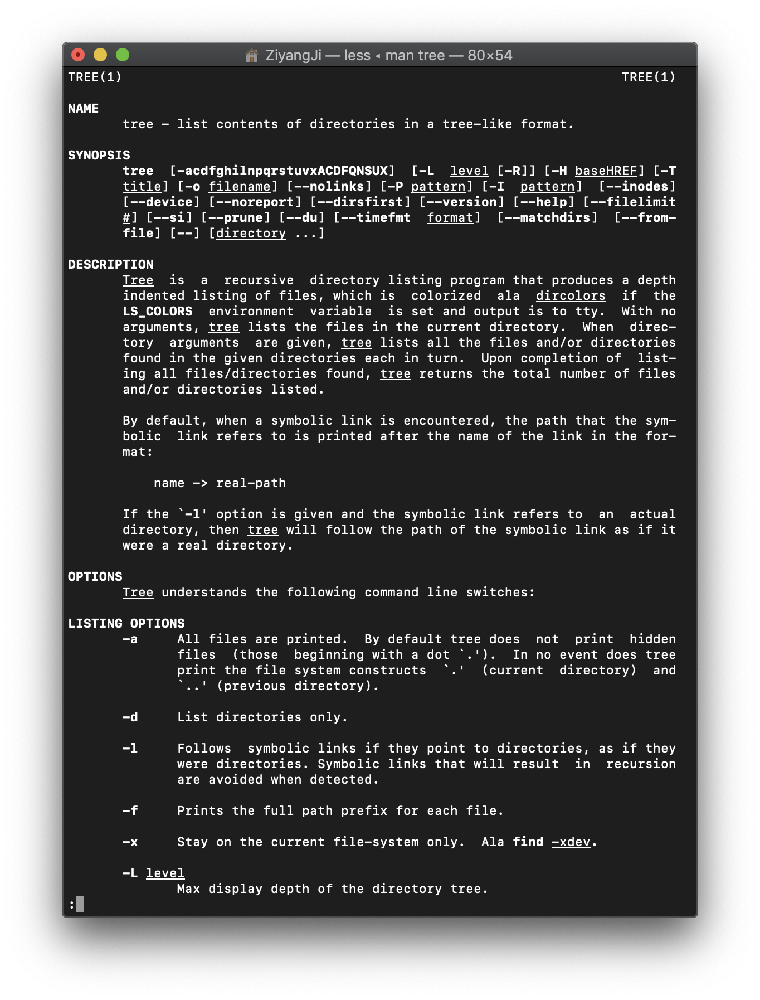
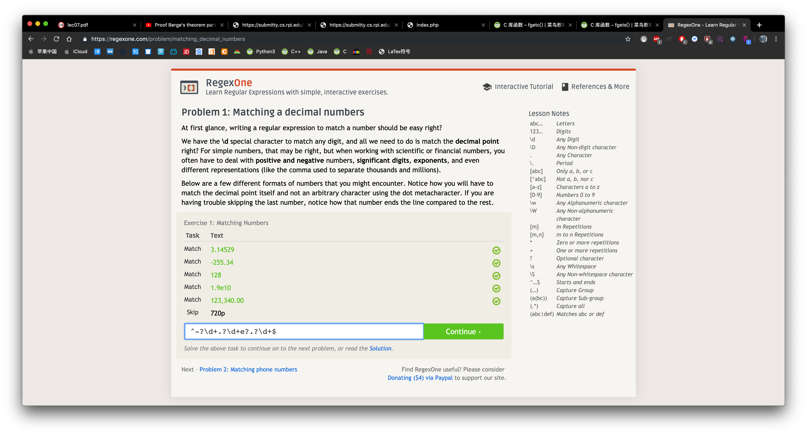
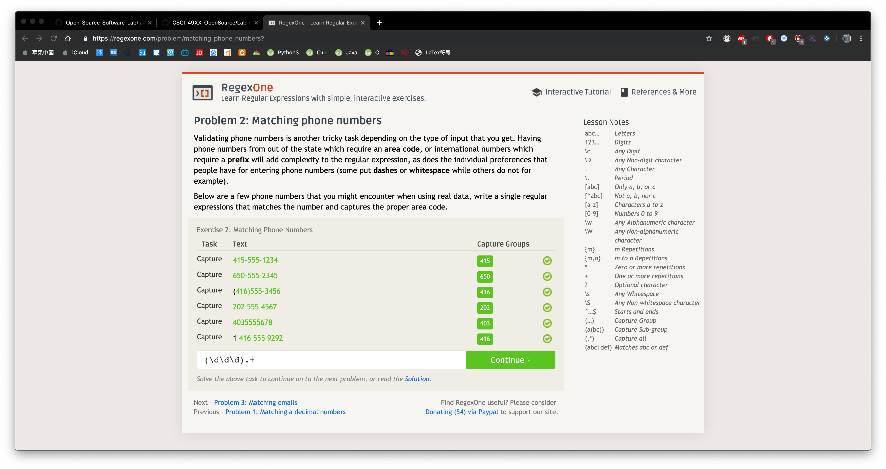
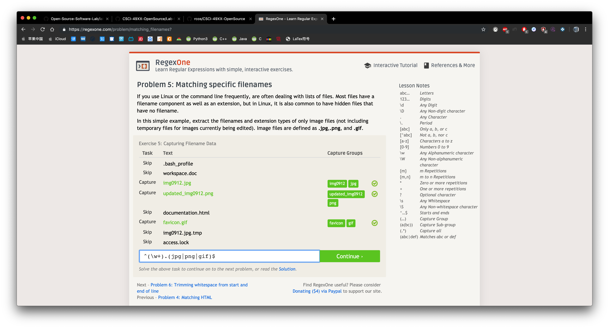
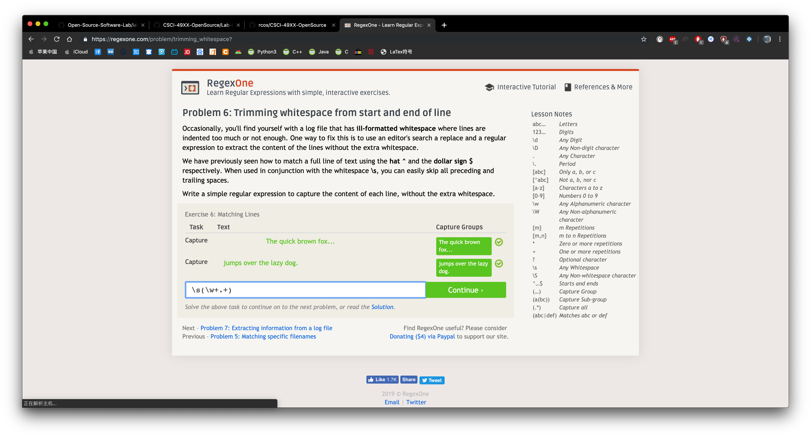

6. They are important because they are the principle of the open source

7.a)double check before asking the questions to avoid some silly questions.  
  b)try to describe the problems with least words but most information/
  
8.After reading chapter 3 in free culture, I realize the importance of having
  the license. We can avoid lots of risks by following the license. A developer 
  may not intentionally to break the law, they just want to help more people to
  make their life easier. So there is no reason to give them any puishment. Also, 
  when you do something that may cause some legal risk, try to consult some lawyer
  to make sure you life will not be destoied by the modification. On the other
  hand, I realize law is not perfect for the development of the world in some extent.

13.screenshot 

15.

Some of these answers are different from the answer provided by the website, hope they can work

16.

18

 
19 I go to the RCOS website and there are lots of open source projects. I am still searching one I am interst in.
If I can't find one, I may probably strat one myself. By looking the link provided, I find they describe the open
source project in a very specific way, which is really heapful for me to understand what is the project aim to do,
the strategy they are using, what still need to do and their achievement. This inspired me a lot and show me a route 
of my future project.
