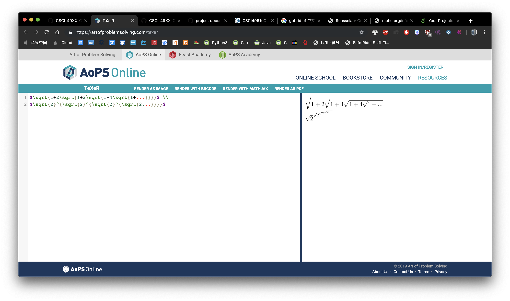
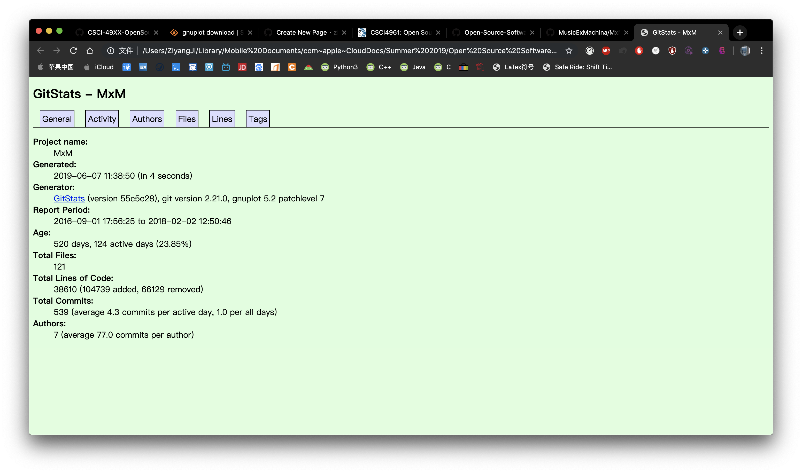
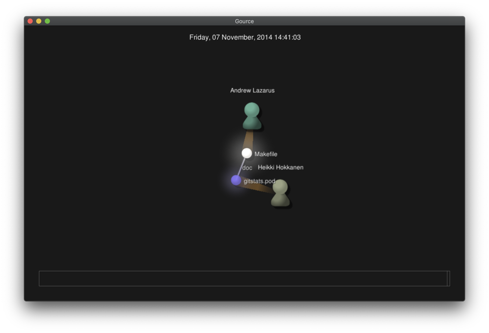

## MxM
 # There are 3 contributors: 
 * Patrick Celentano
 * Jonathan Patsenker
 * Valerie Fix
 
 
# 39059 total lines of code 
 
 
 # the first commit
 commit 2ede95db420dde4ac846342af54236c4c2b2cb1c
Author: PatrickCelentano <dr0ideka>
Date:   Thu Sep 1 17:56:25 2016 -0400

    Initial commit

 # the latest commit 
 commit 86c1612ebadab6a6d1ae47a1fe67c7701427aee4 (HEAD -> master, origin/master, origin/j-develop, origin/HEAD)
Merge: 4cae011 2a49274
Author: Jon Patsenker <jonathan@patsenker.com>
Date:   Fri Feb 2 12:50:46 2018 -0500

    Merge pull request #139 from MusicExMachina/dl-develop
    
    DL develop merge, just in case

# the current branches: origin/master

* total lines of code are different 
* authors number are different

Repository: https://github.com/RCOS-MCFS/RCOS-Microfossil-Sorter
Number of Contributors: 3
Number of lines of code: 109077
First commit:
commit 20cc8976447af277f97834ab2d003474deaaa9bd
Author: John Klingelhofer jkklingelhofer@gmail.com
Date: Fri Jan 26 16:59:32 2018 -0500
Initial commit

Latest commit:
commit 26b5906913dda60b4c9c0de10eee201d3512befd (HEAD -> master, origin/master, origin/HEAD)
Merge: b290bac dbebc90
Author: Olivia Lundelius 35616181+OliviaLundelius@users.noreply.github.com
Date: Mon Apr 15 14:45:50 2019 -0400
Merge pull request #35 from RCOS-MCFS/documentation
Documentation pull request

Current branches:
master
cv_changes

Number of contributors: 8
Number of lines of code: 316178
The first commit:commit 0390cd4efbcece5ffffc01bb5cdf1d7cd4a403a9Author: Bogong Yang yangb7@rpi.eduDate: Sun Jan 20 16:07:13 2019 -0500commit message: "Initial commit"The latest commit:commit 38d0e4bb1ddc88a66163f6f6bb5702bce999a43e (HEAD -> master, origin/master, origin/HEAD)Author: ruizhe lir7@rpi.eduDate: Sat Apr 27 22:07:03 2019 -0400commit message: "add_pic function"Current branches:master

# Part 2
Project: Observatory
contributors: 48
total lines: 33839 + 19951 = 53790
first commit: 
commit ac21a034bd4085bcf9b87fc44b43a558698e02cf
Author: Aaron Gunderson <airgunde@gmail.com>
Date:   Mon Dec 8 21:45:33 2014 -0500

    Initial commit

lastest commit:
commit a15f9bba2a422558d80fe2002e1eda23cf84506b (HEAD -> master, origin/master, origin/HEAD)
Merge: bf6bb93 fb202da
Author: Alexander Schwartzberg <aekschwartzberg@gmail.com>
Date:   Sat Oct 6 12:26:50 2018 -0400

    Merge pull request #783 from aeksco/master

    Sponsors + meeting times & presentation schedule point to handbook

current branchs: 18 + 2

* master
  remotes/origin/Feature-groupSemesters
  remotes/origin/HEAD -> origin/master
  remotes/origin/ag-update-deploy-script
  remotes/origin/attendance-component
  remotes/origin/blogMDEditor
  remotes/origin/blogfolders
  remotes/origin/dev
  remotes/origin/feature/455
  remotes/origin/feature/apidocs
  remotes/origin/gh-pages
  remotes/origin/homepagebuttons
  remotes/origin/master
  remotes/origin/origin/dev
  remotes/origin/rememberme
  remotes/origin/revert-759-dev
  remotes/origin/tagSysteam
  remotes/origin/urp-form
  remotes/origin/vagrant-for-windows
  remotes/origin/yous2

* master
  remotes/origin/HEAD -> origin/master
  remotes/origin/dev
  remotes/origin/master# Part 2
Project: Observatory
contributors: 48
total lines: 33839 + 19951 = 53790
first commit: 
commit ac21a034bd4085bcf9b87fc44b43a558698e02cf
Author: Aaron Gunderson <airgunde@gmail.com>
Date:   Mon Dec 8 21:45:33 2014 -0500

    Initial commit

lastest commit:
commit a15f9bba2a422558d80fe2002e1eda23cf84506b (HEAD -> master, origin/master, origin/HEAD)
Merge: bf6bb93 fb202da
Author: Alexander Schwartzberg <aekschwartzberg@gmail.com>
Date:   Sat Oct 6 12:26:50 2018 -0400

    Merge pull request #783 from aeksco/master

    Sponsors + meeting times & presentation schedule point to handbook

current branchs: 18 + 2

* master
  remotes/origin/Feature-groupSemesters
  remotes/origin/HEAD -> origin/master
  remotes/origin/ag-update-deploy-script
  remotes/origin/attendance-component
  remotes/origin/blogMDEditor
  remotes/origin/blogfolders
  remotes/origin/dev
  remotes/origin/feature/455
  remotes/origin/feature/apidocs
  remotes/origin/gh-pages
  remotes/origin/homepagebuttons
  remotes/origin/master
  remotes/origin/origin/dev
  remotes/origin/rememberme
  remotes/origin/revert-759-dev
  remotes/origin/tagSysteam
  remotes/origin/urp-form
  remotes/origin/vagrant-for-windows
  remotes/origin/yous2

* master
  remotes/origin/HEAD -> origin/master
  remotes/origin/dev
  remotes/origin/master
  
  ## MultiMC  
# The number of contributors:  
44
# Number of lines of code:  
55049
# The first commit  
Wed Jan 9 12:22:22 2013
# The latest commit  
Sat Jun 1 18:05:42 2019
# The current branches  
* develop  
  remotes/origin/HEAD -> origin/develop  
  remotes/origin/develop  
  remotes/origin/feature/artifact_overhaul  
  remotes/origin/feature/cert_pinning  
  remotes/origin/feature/offline_mode_name_choices  
  remotes/origin/feature/options_management  
  remotes/origin/feature/windows_graphics_probing  
  remotes/origin/stable

