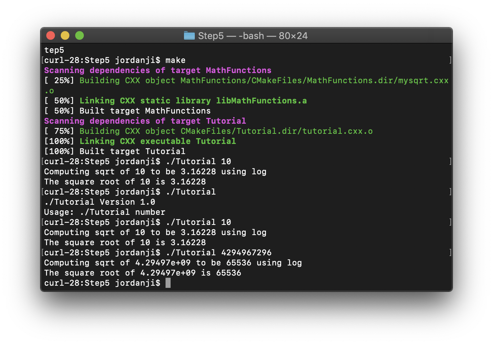

 (by checking step6)


## Makefile
```
all: program programSh
program: program.c block.a Makefile
	gcc program.c block.a -o program
programSh: program.c block.so Makefile
	gcc program.c block.so -o programSh -Wl,-rpath .
block.a: block.o Makefile
	ar qc block.a block.o
block.so: block.o Makefile
	gcc -shared -o block.so block.o
block.o: source/block.c Makefile
	gcc -fPIC -c source/block.c -o block.o
  ```
  ## CMakeLists.txt
  ```

cmake_minimum_required (VERSIOn 2.6)
project (Program)
add_library(block.a ../source/block.c)
add_executable(Program ../program.c)
target_link_libraries(Program block.a)

project (ProgramSh)
add_library(block.so SHARED
  ../source/block.c)
 add_executable(ProgramSh ../program.c)
 target_link_libraries(ProgramSh block.so)
 ```
 
 
 ## Makefile created by cmake
 ```
 # CMAKE generated file: DO NOT EDIT!
# Generated by "Unix Makefiles" Generator, CMake Version 3.13

# Default target executed when no arguments are given to make.
default_target: all

.PHONY : default_target

# Allow only one "make -f Makefile2" at a time, but pass parallelism.
.NOTPARALLEL:


#=============================================================================
# Special targets provided by cmake.

# Disable implicit rules so canonical targets will work.
.SUFFIXES:


# Remove some rules from gmake that .SUFFIXES does not remove.
SUFFIXES =

.SUFFIXES: .hpux_make_needs_suffix_list


# Suppress display of executed commands.
$(VERBOSE).SILENT:


# A target that is always out of date.
cmake_force:

.PHONY : cmake_force

#=============================================================================
# Set environment variables for the build.

# The shell in which to execute make rules.
SHELL = /bin/sh

# The CMake executable.
CMAKE_COMMAND = /usr/local/bin/cmake

# The command to remove a file.
RM = /usr/local/bin/cmake -E remove -f
# Escaping for special characters.
EQUALS = =

# The top-level source directory on which CMake was run.
CMAKE_SOURCE_DIR = /root/lab5/part2/Lab-Example

# The top-level build directory on which CMake was run.
CMAKE_BINARY_DIR = /root/lab5/part2/Lab-Example/build

#=============================================================================
# Targets provided globally by CMake.

# Special rule for the target rebuild_cache
rebuild_cache:
        @$(CMAKE_COMMAND) -E cmake_echo_color --switch=$(COLOR) --cyan "Running CMake to regenerate build system..."
        /usr/local/bin/cmake -S$(CMAKE_SOURCE_DIR) -B$(CMAKE_BINARY_DIR)
.PHONY : rebuild_cache

# Special rule for the target rebuild_cache
rebuild_cache/fast: rebuild_cache

.PHONY : rebuild_cache/fast

# Special rule for the target edit_cache
edit_cache:
        @$(CMAKE_COMMAND) -E cmake_echo_color --switch=$(COLOR) --cyan "No interactive CMake dialog available..."
        /usr/local/bin/cmake -E echo No\ interactive\ CMake\ dialog\ available.
.PHONY : edit_cache

# Special rule for the target edit_cache
edit_cache/fast: edit_cache

.PHONY : edit_cache/fast

# The main all target
all: cmake_check_build_system
        $(CMAKE_COMMAND) -E cmake_progress_start /root/lab5/part2/Lab-Example/build/CMakeFiles /root/lab5/part2/Lab-Example/build/CMakeFiles/progress.marks
        $(MAKE) -f CMakeFiles/Makefile2 all
        $(CMAKE_COMMAND) -E cmake_progress_start /root/lab5/part2/Lab-Example/build/CMakeFiles 0
.PHONY : all

# The main clean target
clean:
        $(MAKE) -f CMakeFiles/Makefile2 clean
.PHONY : clean

# The main clean target
clean/fast: clean

.PHONY : clean/fast

# Prepare targets for installation.
preinstall: all
        $(MAKE) -f CMakeFiles/Makefile2 preinstall
.PHONY : preinstall

# Prepare targets for installation.
preinstall/fast:
        $(MAKE) -f CMakeFiles/Makefile2 preinstall
.PHONY : preinstall/fast

# clear depends
depend:
        $(CMAKE_COMMAND) -S$(CMAKE_SOURCE_DIR) -B$(CMAKE_BINARY_DIR) --check-build-system CMakeFiles/Makefile.cmake 1
.PHONY : depend

#=============================================================================
# Target rules for targets named libblock

# Build rule for target.
libblock: cmake_check_build_system
        $(MAKE) -f CMakeFiles/Makefile2 libblock
.PHONY : libblock

# fast build rule for target.
libblock/fast:
        $(MAKE) -f CMakeFiles/libblock.dir/build.make CMakeFiles/libblock.dir/build
.PHONY : libblock/fast

#=============================================================================
# Target rules for targets named static_block

# Build rule for target.
static_block: cmake_check_build_system
        $(MAKE) -f CMakeFiles/Makefile2 static_block
.PHONY : static_block

# fast build rule for target.
static_block/fast:
        $(MAKE) -f CMakeFiles/static_block.dir/build.make CMakeFiles/static_block.dir/build
.PHONY : static_block/fast

#=============================================================================
# Target rules for targets named dylibblock

# Build rule for target.
dylibblock: cmake_check_build_system
        $(MAKE) -f CMakeFiles/Makefile2 dylibblock
.PHONY : dylibblock

# fast build rule for target.
dylibblock/fast:
        $(MAKE) -f CMakeFiles/dylibblock.dir/build.make CMakeFiles/dylibblock.dir/build
.PHONY : dylibblock/fast

#=============================================================================
# Target rules for targets named dynamic_block

# Build rule for target.
dynamic_block: cmake_check_build_system
        $(MAKE) -f CMakeFiles/Makefile2 dynamic_block
.PHONY : dynamic_block

# fast build rule for target.
dynamic_block/fast:
        $(MAKE) -f CMakeFiles/dynamic_block.dir/build.make CMakeFiles/dynamic_block.dir/build
.PHONY : dynamic_block/fast

program.o: program.c.o

.PHONY : program.o

# target to build an object file
program.c.o:
        $(MAKE) -f CMakeFiles/static_block.dir/build.make CMakeFiles/static_block.dir/program.c.o
        $(MAKE) -f CMakeFiles/dynamic_block.dir/build.make CMakeFiles/dynamic_block.dir/program.c.o
.PHONY : program.c.o
program.i: program.c.i

.PHONY : program.i

# target to preprocess a source file
program.c.i:
        $(MAKE) -f CMakeFiles/static_block.dir/build.make CMakeFiles/static_block.dir/program.c.i
        $(MAKE) -f CMakeFiles/dynamic_block.dir/build.make CMakeFiles/dynamic_block.dir/program.c.i
.PHONY : program.c.i

program.s: program.c.s

.PHONY : program.s

# target to generate assembly for a file
program.c.s:
        $(MAKE) -f CMakeFiles/static_block.dir/build.make CMakeFiles/static_block.dir/program.c.s
        $(MAKE) -f CMakeFiles/dynamic_block.dir/build.make CMakeFiles/dynamic_block.dir/program.c.s
.PHONY : program.c.s

source/block.o: source/block.c.o

.PHONY : source/block.o

# target to build an object file
source/block.c.o:
        $(MAKE) -f CMakeFiles/libblock.dir/build.make CMakeFiles/libblock.dir/source/block.c.o
        $(MAKE) -f CMakeFiles/dylibblock.dir/build.make CMakeFiles/dylibblock.dir/source/block.c.o
.PHONY : source/block.c.o

source/block.i: source/block.c.i

.PHONY : source/block.i

# target to preprocess a source file
source/block.c.i:
        $(MAKE) -f CMakeFiles/libblock.dir/build.make CMakeFiles/libblock.dir/source/block.c.i
        $(MAKE) -f CMakeFiles/dylibblock.dir/build.make CMakeFiles/dylibblock.dir/source/block.c.i
.PHONY : source/block.c.i

source/block.s: source/block.c.s

.PHONY : source/block.s

# target to generate assembly for a file
source/block.c.s:
        $(MAKE) -f CMakeFiles/libblock.dir/build.make CMakeFiles/libblock.dir/source/block.c.s
        $(MAKE) -f CMakeFiles/dylibblock.dir/build.make CMakeFiles/dylibblock.dir/source/block.c.s
.PHONY : source/block.c.s

# Help Target
help:
        @echo "The following are some of the valid targets for this Makefile:"
        @echo "... all (the default if no target is provided)"
        @echo "... clean"
        @echo "... depend"
        @echo "... rebuild_cache"
        @echo "... edit_cache"
        @echo "... libblock"
        @echo "... static_block"
        @echo "... dylibblock"
        @echo "... dynamic_block"
        @echo "... program.o"
        @echo "... program.i"
        @echo "... program.s"
        @echo "... source/block.o"
        @echo "... source/block.i"
        @echo "... source/block.s"
.PHONY : help


#=============================================================================
# Special targets to cleanup operation of make.

# Special rule to run CMake to check the build system integrity.
# No rule that depends on this can have commands that come from listfiles
# because they might be regenerated.
cmake_check_build_system:
        $(CMAKE_COMMAND) -S$(CMAKE_SOURCE_DIR) -B$(CMAKE_BINARY_DIR) --check-build-system CMakeFiles/Makefile.cmake 0
.PHONY : cmake_check_build_system
```

## size
```
-rwxrwxrwx 1 root root  8600 Jun 27 22:36 dynamic_block
-rwxrwxrwx 1 root root  8784 Jun 27 22:30 static_block
```
## output
```
root@DESKTOP-1O100B3:~/lab5/part2/Lab-Example/build# ./static_block
d y n a m i c   o r   s t a t i c
y n a m i c   o r   s t a t i c d
n a m i c   o r   s t a t i c d y
a m i c   o r   s t a t i c d y n
m i c   o r   s t a t i c d y n a
i c   o r   s t a t i c d y n a m
c   o r   s t a t i c d y n a m i
  o r   s t a t i c d y n a m i c
o r   s t a t i c d y n a m i c
r   s t a t i c d y n a m i c   o
  s t a t i c d y n a m i c   o r
s t a t i c d y n a m i c   o r
t a t i c d y n a m i c   o r   s
a t i c d y n a m i c   o r   s t
t i c d y n a m i c   o r   s t a
i c d y n a m i c   o r   s t a t
c d y n a m i c   o r   s t a t i
root@DESKTOP-1O100B3:~/lab5/part2/Lab-Example/build# ./dynamic_block
d y n a m i c   o r   s t a t i c
y n a m i c   o r   s t a t i c d
n a m i c   o r   s t a t i c d y
a m i c   o r   s t a t i c d y n
m i c   o r   s t a t i c d y n a
i c   o r   s t a t i c d y n a m
c   o r   s t a t i c d y n a m i
  o r   s t a t i c d y n a m i c
o r   s t a t i c d y n a m i c
r   s t a t i c d y n a m i c   o
  s t a t i c d y n a m i c   o r
s t a t i c d y n a m i c   o r
t a t i c d y n a m i c   o r   s
a t i c d y n a m i c   o r   s t
t i c d y n a m i c   o r   s t a
i c d y n a m i c   o r   s t a t
c d y n a m i c   o r   s t a t i
```
